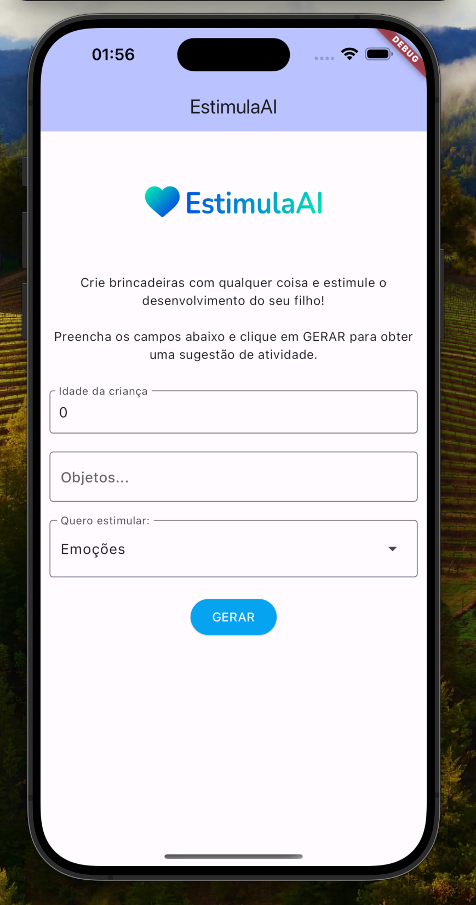

    
    <h3 align="center">EstimulaAI</h3>
  </a>

  Crie brincadeiras com qualquer coisa e estimule o desenvolvimento do seu filho! 🌈💙

  <a href="https://adspacheco.gitbook.io/estimulaai"><strong>Documentação</strong></a> ·
  <a href="https://github.com/EstimulaAI/projeto/blob/main/Prot%C3%B3tipo_EstimulaAI.ipynb"><strong>Jupyter Notebook</strong></a> ·
  <a href="https://github.com/EstimulaAI/projeto/tree/main/flutter_app"><strong>App Flutter</strong></a>

## EstimulaAI

O EstimulaAI é uma aplicação que usa o Gemini, a inteligência artificial do Google, para criar brincadeiras, transformando objetos cotidianos em ferramentas que auxiliam o desenvolvimento infantil. 🧠

## Contexto

O projeto foi criado como entrega do desafio proposto durante a imersão de IA com o Google Gemini promovida pela Alura e pelo Google.

<figcaption></figcaption>

Em um primeiro momento, foi criado um protótipo do EstimulaAI usando o Google Colab e posteriormente a aplicação foi construída utilizando Flutter.

Adicionalmente foi construída uma identidade visual e uma [documentação com detalhes e spoilers da construção do projeto](https://adspacheco.gitbook.io/estimulaai) 👀

## Protótipo - Jupyter Notebook

O protótipo do EstimulaAI foi desenvolvido no Google Colab utilizando o SDK do Google GenerativeAI. 

## Aplicação - Flutter

<figcaption></figcaption>

O aplicativo foi construído utilizando Flutter, e essa decisão foi motivada visando democratizar o acesso ao EstimulaAI ao permitir a exportação do código para todas as principais plataformas - iOS, Android e web. 

## Demonstração

Vídeo da aplicação em funcionamento:

## Identidade Visual - Google Drawings

<figcaption></figcaption>

[Coração ícones criados por Laisa Islam Ani - Flaticon](https://www.flaticon.com/br/icones-gratis/coracao)

Confira o projeto no [Google Drawings](https://docs.google.com/drawings/d/11FGavAQJcTqmHO4V3oK2vHj6Q-vLwlRbv83esxslXHo/edit)

## Documentação

Para mais detalhes sobre a construção do projeto, consulte a [documentação completa](https://adspacheco.gitbook.io/estimulaai).