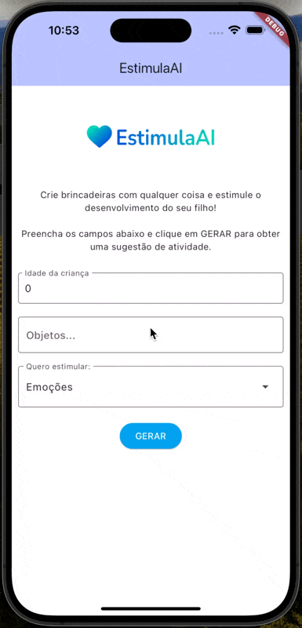

<p align="center">
    
    <h3 align="center">EstimulaAI</h3>
  </a>
</p>

<p align="center">
  Crie brincadeiras com qualquer coisa e estimule o desenvolvimento do seu filho! 🌈💙
</p>

<p align="center">
  <a href="https://adspacheco.gitbook.io/estimulaai"><strong>Documentação</strong></a> ·
  <a href="https://github.com/EstimulaAI/projeto/blob/main/Prot%C3%B3tipo_EstimulaAI.ipynb"><strong>Jupyter Notebook</strong></a> ·
  <a href="https://github.com/EstimulaAI/projeto/tree/main/flutter_app"><strong>App Flutter</strong></a>
</p>

## EstimulaAI

O EstimulaAI é uma aplicação que usa o Gemini, a inteligência artificial do Google, para criar brincadeiras, transformando objetos cotidianos em ferramentas que auxiliam o desenvolvimento infantil. 🧠

## Contexto do Projeto

O projeto foi criado como entrega do desafio proposto durante a imersão de IA com o Google Gemini promovida pela Alura e pelo Google.


<figcaption></figcaption>

Em um primeiro momento, foi criado um protótipo do EstimulaAI usando o Google Colab, posteriormente a aplicação foi construída utilizando Flutter e depois aperfeiçoada com backend em Python.

Adicionalmente foi construída uma identidade visual e uma [documentação com detalhes e spoilers da construção do projeto](https://adspacheco.gitbook.io/estimulaai) 👀

## Contexto Negocial

A primeira infância é crucial para o desenvolvimento integral. Muitas famílias enfrentam desafios para acessar terapias adequadas devido a custos e falta de recursos. 

Além disso, as horas de terapia na clínica não descartam a continuidade das estimulações em casa. 🏠


O EstimulaAI surge como uma solução gratuita que utiliza tecnologia para complementar as terapias existentes, facilitando o acesso a um desenvolvimento saudável e equitativo.

## Contexto Técnico

A aplicação combina uma API Python com uma interface Flutter, projetada para ser intuitiva. 

O usuário inserem apenas a idade da criança, a área de desenvolvimento desejada e os itens disponíveis para a brincadeira. 

A API processa essas informações e sugere atividades personalizadas.


Os Perfis de Desenvolvimento representam diferentes fases do crescimento infantil com marcos associados a habilidades físicas, sociais, emocionais e cognitivas, são fundamentais no processo. 


Cada perfil foi criado a partir da digitalização e transcrição da carteira de vacinação do meu filho Gabriel.

Essas informações são orietanções Gerais do Ministério da Saúde e não possui nenhum dado particular do Gabriel.

Assim, utilizei o Gemini para garantir que as informações fossem precisamente capturadas e formatadas conforme aprendido durante a Imersão IA (e claro, acelerar minha entrega e otimizar meu tempo! Vlw Google 😉)

Exemplo de um Perfil de Desenvolvimento:

```json
    DOCUMENT = {
        "Title": "Relacionar",
        "Content": "1 ano. Esperado: Responde ativamente ao contato social, imita gestos, mostra o que quer. Sugerido: Brincadeiras de imitacao, jogos interativos com outras criancas ou adultos, como esconde-achou."
    }
```

Quando um usuário insere dados no aplicativo, o sistema gera uma consulta baseada na idade da criança e na área de desenvolvimento desejada. Essa consulta é convertida em um embedding pelo modelo Gemini, e então comparada com os embeddings dos Perfis de Desenvolvimento. 

Este processo identifica o documento mais alinhado às necessidades específicas da criança.

A seguir, o sistema utiliza o modelo Gemini 1.0 para a geração da brincadeira. Este modelo é configurado com parâmetros que garantem uma resposta segura e criativa:

```python
generation_config = {
    "candidate_count": 1,  # Retorna apenas a melhor opção
    "temperature": 0.6     # Ajusta a criatividade para produzir sugestões inovadoras mas seguras
}

safety_settings = {
    'HATE': 'BLOCK_LOW_AND_ABOVE',
    'HARASSMENT': 'BLOCK_LOW_AND_ABOVE',
    'SEXUAL': 'BLOCK_LOW_AND_ABOVE',
    'DANGEROUS': 'BLOCK_LOW_AND_ABOVE'
}
````

A combinação dessas tecnologias não só maximiza a eficiência do processo de sugestão de atividades, mas também adere a padrões rigorosos de segurança e ética, prevenindo sugestões inadequadas ou inseguras.

## Protótipo - Jupyter Notebook

O protótipo do EstimulaAI foi desenvolvido no Google Colab utilizando o SDK do Google GenerativeAI. 

<a href="https://colab.research.google.com/github/EstimulaAI/projeto/blob/main/Prot%C3%B3tipo_EstimulaAI.ipynb"></a>

## Aplicação - Flutter

<p align="center">
<figcaption></figcaption>
</p>

O aplicativo foi construído utilizando Flutter, e essa decisão foi motivada visando democratizar o acesso ao EstimulaAI ao permitir a exportação do código para todas as principais plataformas - iOS, Android e web. 

<p align="center">
  <b>
    <a href="https://www.youtube.com/watch?v=R_boKu4PiwY">Demonstração em Vídeo</a>
  </b>
</p>

## Backend API - Python

A API foi construída usando Pyhon, especificamente com a utilização da biblioteca Litestar, que agiliza o processo de criação e conta com documentação e validação de dados usando Pydantic.

## Identidade Visual - Google Drawings

<figcaption></figcaption>

[Coração ícones criados por Laisa Islam Ani - Flaticon](https://www.flaticon.com/br/icones-gratis/coracao)

Confira o projeto no [Google Drawings](https://docs.google.com/drawings/d/11FGavAQJcTqmHO4V3oK2vHj6Q-vLwlRbv83esxslXHo/edit)

## Documentação

Para mais detalhes sobre a construção do projeto, consulte a [documentação completa](https://adspacheco.gitbook.io/estimulaai).

## Créditos

Imagens por <a href="https://unsplash.com/@clarktibbs?utm_content=creditCopyText&utm_medium=referral&utm_source=unsplash">Clark Tibbs</a> e <a href="https://unsplash.com/@robbie36?utm_content=creditCopyText&utm_medium=referral&utm_source=unsplash">Robert Collins</a> em <a href="https://unsplash.com/photos/four-boy-playing-ball-on-green-grass-tvc5imO5pXk?utm_content=creditCopyText&utm_medium=referral&utm_source=unsplash">Unsplash</a>
  